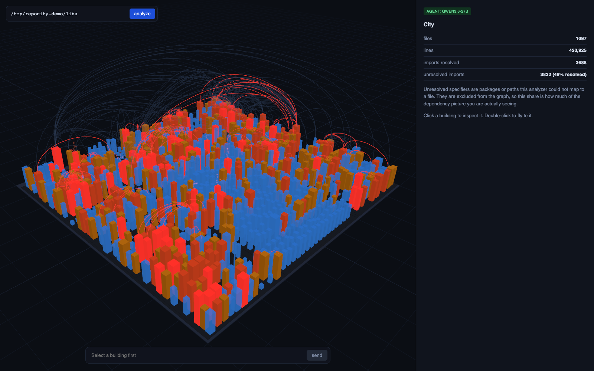
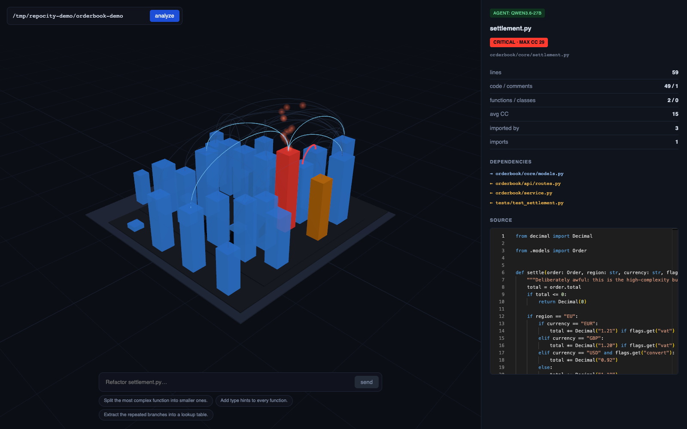
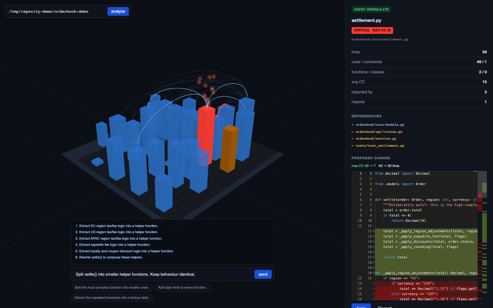
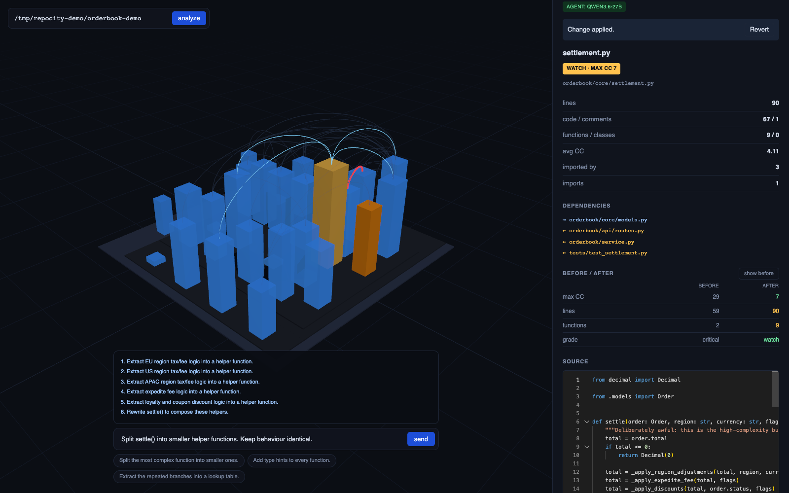

# repoCity

[](https://github.com/mspark2Dev/repo-city/actions/workflows/ci.yml)
[](LICENSE)

Turn a codebase into a city you can fly through — then send an agent to clean up the bad neighborhoods.

repoCity statically analyzes a repository, renders it as a 3D city where every building is a file,
and lets you point a local LLM at the ugly parts to propose refactorings. Buildings grow with lines
of code and rust over with cyclomatic complexity, so the parts of your codebase that need attention
are the ones you notice first.



> **Status: pre-alpha but complete end to end.** Analyze a repository, fly through it, hand a
> file to the agent, review the diff, apply it, and watch that building rebuild itself.
> See [docs/ROADMAP.md](docs/ROADMAP.md) for what each phase delivered.

## The idea

| You see | It means |
|---|---|
| A district | A directory |
| A building | A file |
| Building height | Lines of code |
| Rusted concrete, red glow, smoke | High cyclomatic complexity |
| Clean glass, blue neon | Low complexity |
| Glowing arcs between buildings | Imports |
| A thick red tangle | A circular dependency |

Click a building to inspect its metrics and source.



Then type a command — *"split the most complex function in this file"* — and an agent reads the
file plus its direct dependencies, proposes a diff, and shows it to you.



Accept it, and the building rebuilds itself into whatever the refactoring produced, with the
before and after side by side.



## How it works

```
apps/web            React Three Fiber canvas + Monaco inspector + command bar
services/analyzer   Python: tree-sitter parsing, metrics, import graph, treemap layout
                    FastAPI REST + WebSocket, agent runtime
LLM                 Any OpenAI-compatible endpoint (vLLM, Ollama, LM Studio)
```

The analyzer produces a `CityMap.json` — a stable, deterministic description of the city. Stable
IDs are what make the refactoring animation meaningful: when a file changes, only that building
changes, and the rest of the city stays exactly where you left it.

Design decisions and their rationale live in [docs/DESIGN.md](docs/DESIGN.md) (Korean).

## Safety

The agent never writes to your files on its own. It produces a unified diff, verifies the result
still parses, and shows it to you. Files are only written when you explicitly apply the change, and
the originals are snapshotted so you can revert.

## Getting started

```bash
pnpm install

# Terminal 1 — analyzer
cd services/analyzer && uv sync && uv run uvicorn repocity.app:app --port 8787

# Terminal 2 — web
pnpm dev            # http://localhost:5173
```

The field at the top left takes either a local path or a git URL:

```
/path/to/your/project
https://github.com/owner/repo.git
git@gitlab.example.com:group/repo.git
```

Without a branch you get the remote's default, whatever it is called. To analyze something
else, add `#branch` or paste the address of a branch page:

```
https://github.com/owner/repo.git#develop
https://github.com/owner/repo/tree/release-2.0
https://github.com/owner/repo/tree/main/packages/core   # just that subdirectory
https://gitlab.example.com/group/repo/-/tree/staging
```

Tags work anywhere a branch does. Each ref gets its own checkout, so switching between them
leaves the other alone.

Remote repositories are cloned shallowly into `~/.local/share/repocity/clones/`. An existing
checkout is reused rather than refetched, so changes you applied there are not thrown away.
Private repositories use whatever credentials git already has; repoCity never prompts.

To analyze without the UI:

```bash
cd services/analyzer
uv run repocity analyze ../../fixtures/sample-project --stats -o citymap.json
```

`fixtures/sample-project` is a small Python project with a circular dependency and one
very high complexity function deliberately planted in it, so you can see what those look
like in the city before pointing repoCity at your own code.

## Language

The interface is in English or Korean, chosen from the browser's language preferences on
first load, with a toggle in the top right that is remembered afterwards. English is the
source of truth for the message catalogue: `Messages` is derived from it, so a key missing
from Korean is a compile error rather than a string that silently falls back.

## Reaching it from another machine

The dev server binds to localhost. To use repoCity from a second machine — over a VPN such
as Tailscale, say — bind it to that interface and name the hosts you will use:

```bash
REPOCITY_WEB_HOST=100.x.y.z \
REPOCITY_ALLOWED_HOSTS=myhost,myhost.example.ts.net \
pnpm dev
```

Only the web server needs to be reachable: it proxies `/api` and `/ws` server-side, so the
analyzer stays on loopback. Do not expose the analyzer itself.

Bind to a specific interface rather than `0.0.0.0`. Anyone who can reach this server can
analyze any path this machine can read and, with an agent endpoint configured, write to it.
A private VPN interface is a reasonable place for that; a LAN or the internet is not.

## Using the agent

Point `LLM_BASE_URL` at any OpenAI-compatible endpoint in `.env`:

```env
LLM_BASE_URL=http://<host>:<port>/v1
LLM_MODEL=<model served there>
LLM_CONTEXT_BUDGET=60000
```

Select a building, type an instruction in the bar at the bottom, and read the diff before
deciding. Nothing is written until you press Apply, the originals are snapshotted outside
your repository, and Revert restores them byte for byte.

## Languages

| | |
|---|---|
| Size, complexity, symbols **and imports** | Python, TypeScript, JavaScript, Java, Kotlin, C, C++ |
| Size, complexity, symbols | Go, Rust, C#, Ruby, PHP, Swift, Scala |
| Lines only | everything else it can read |

Metrics need only a grammar; a dependency graph needs that language's module rules written
out, which is why the two lists differ. The panel reports what share of imports resolved,
so the gap is visible rather than implied.

## Requirements

- Node.js 22.13+ (pnpm 11 requires it) and pnpm 11+
- Python 3.12+ (managed with [uv](https://docs.astral.sh/uv/))
- An OpenAI-compatible LLM endpoint for the refactoring features (optional — analysis and
  visualization work without one)

## Documentation

| | |
|---|---|
| [docs/OVERVIEW.md](docs/OVERVIEW.md) | Why this exists and how the pieces fit |
| [docs/DESIGN.md](docs/DESIGN.md) | Schema, API, visual mapping rules (Korean) |
| [docs/ROADMAP.md](docs/ROADMAP.md) | Phased plan with acceptance criteria (Korean) |
| [CONTRIBUTING.md](CONTRIBUTING.md) | Development setup and conventions |

한국어 안내는 [README.ko.md](README.ko.md) 를 참고하세요.

## Security

repoCity reads the directory you point it at and, when you use the agent, sends the file
being refactored to your configured model endpoint. See [SECURITY.md](SECURITY.md) for what
that means and how to report a vulnerability.

## License

MIT — see [LICENSE](LICENSE).
